# 🚣 Universal Kayak Directory - Process Flow Diagram

## Complete Business Addition Workflow

```mermaid
flowchart TD
    A[🚀 Start: Add Businesses from Location] --> B{Environment Setup Complete?}
    
    B -->|No| C[⚙️ One-Time Setup]
    C --> C1[Get Google Maps API Key]
    C1 --> C2[Get Airtable API Key]
    C2 --> C3[Create .env file with keys]
    C3 --> C4[Install Node.js dependencies]
    C4 --> C5[Install Python dependencies]
    C5 --> B
    
    B -->|Yes| D[📍 Input Target Location]
    D --> E[🔍 Load Existing 812+ Business IDs]
    
    E --> F[🎯 Execute Universal Scraper]
    F --> F1[Search Google Places API]
    F1 --> F2[Apply Location-Specific Search Terms]
    F2 --> F3{Business Found?}
    
    F3 -->|No| F4[📊 Show Results Summary]
    F3 -->|Yes| G[📍 Geographic Validation]
    
    G --> G1[Calculate Distance from Search Center]
    G1 --> G2[Check Regional Exclusion List]
    G2 --> G3{Geographically Valid?}
    
    G3 -->|No| H1[🚫 Reject: Wrong Region/Distance]
    H1 --> F3
    G3 -->|Yes| H[🔄 Duplicate Check]
    
    H --> H2{Already in Directory?}
    H2 -->|Yes| H3[⏭️ Skip: Duplicate Avoided]
    H3 --> F3
    H2 -->|No| I[✅ New Business Found]
    
    I --> J[📝 Generate Enhanced Description]
    J --> J1[Create Location-Specific Content]
    J1 --> J2[Add SEO-Optimized Details]
    J2 --> J3[Include Local Context]
    J3 --> K[💾 Save to CSV File]
    K --> F3
    
    F4 --> L[📊 Processing Complete]
    L --> M{New Businesses Found?}
    
    M -->|No| N1[ℹ️ No New Businesses Message]
    N1 --> N2[Location Already Well Covered]
    N2 --> END[🏁 Process Complete]
    
    M -->|Yes| N[⬆️ Upload to Airtable]
    N --> N3[Map Fields to Directory Schema]
    N3 --> N4[Batch Upload New Businesses]
    N4 --> N5{Upload Successful?}
    
    N5 -->|No| O1[❌ Upload Failed]
    O1 --> O2[Check API Permissions]
    O2 --> O3[Verify Internet Connection]
    O3 --> O4[Review Error Messages]
    O4 --> P1[🔧 Manual Troubleshooting Required]
    P1 --> END
    
    N5 -->|Yes| O[✅ Upload Successful]
    O --> Q[📈 Generate Success Report]
    Q --> Q1[Show Business Count Added]
    Q1 --> Q2[Display API Cost Used]
    Q2 --> Q3[Show Processing Time]
    Q3 --> Q4[Provide Airtable Link]
    Q4 --> R[🎉 Process Complete Successfully]
    R --> END

    %% Styling
    classDef startEnd fill:#e1f5fe,stroke:#01579b,stroke-width:3px
    classDef process fill:#f3e5f5,stroke:#4a148c,stroke-width:2px
    classDef decision fill:#fff3e0,stroke:#e65100,stroke-width:2px
    classDef success fill:#e8f5e8,stroke:#2e7d32,stroke-width:2px
    classDef error fill:#ffebee,stroke:#c62828,stroke-width:2px
    classDef setup fill:#e3f2fd,stroke:#1565c0,stroke-width:2px
    
    class A,END startEnd
    class F,F1,F2,J,J1,J2,J3,K,L,N,N3,N4,Q,Q1,Q2,Q3,Q4 process
    class B,F3,G3,H2,M,N5 decision
    class I,O,R success
    class H1,H3,N1,O1,O4,P1 error
    class C,C1,C2,C3,C4,C5 setup
```



## Key Process Components

### 🔧 One-Time Setup Requirements
- Google Maps API key with Places API enabled
- Airtable API key with write permissions
- Node.js 18+ and Python 3.8+ installed
- Environment configuration in `.env` file

### 🎯 Core Processing Features
- **Smart Search**: Location-specific terms with geographic targeting
- **Duplicate Prevention**: Checks against existing 812+ businesses
- **Geographic Validation**: Distance calculations and regional filtering
- **Enhanced Content**: Location-specific SEO descriptions
- **Direct Integration**: Seamless Airtable directory upload

### 📊 Expected Results by Location Type
| Location Type | Business Count | API Cost | Processing Time |
|---------------|----------------|----------|-----------------|
| Small City    | 10-20         | $1-2     | 30-60 seconds   |
| Large Metro   | 30-50         | $2-5     | 60-90 seconds   |
| Major Metro   | 50+           | $5-10    | 90-120 seconds  |

### 🚀 Quick Start Command
```bash
cd scripts/
./run_location_scraper.sh "Your Target City"
```

### 📈 Success Indicators
```
📊 Loaded 812 existing place IDs          # Duplicate prevention active
🎯 Searching in [Location]...              # Location search started  
✅ NEW: Business Name - Business #X        # New business found
⏭️ Skipped duplicate: Business Name       # Duplicate avoided
🚫 Rejected Name: Distance/Region reason   # Geographic filtering
🎉 [LOCATION] UPLOAD COMPLETE!            # Process successful
```

## Related Documentation
- **Primary Process Guide**: [BUSINESS_ADDITION_PROCESS.md](BUSINESS_ADDITION_PROCESS.md)
- **Quick Reference**: [scripts/QUICK_REFERENCE.md](scripts/QUICK_REFERENCE.md)
- **Technical Guide**: [scripts/README.md](scripts/README.md)
- **System Architecture**: [PRD.md](PRD.md)

---

*This flowchart represents the Universal Template System v2.0 for adding kayak rental businesses from any location worldwide to the existing Airtable directory.*